# 컷모아 (CutMoa)

GitHub: https://github.com/kjt7942/cutmoa

짧은 컷을 모아 한 편으로. 여러 클립 촬영 → 병합 → 오버레이(텍스트/스티커) 편집 → 내보내기까지 지원하는 Android 숏폼 비디오 앱.

<p align="center">
  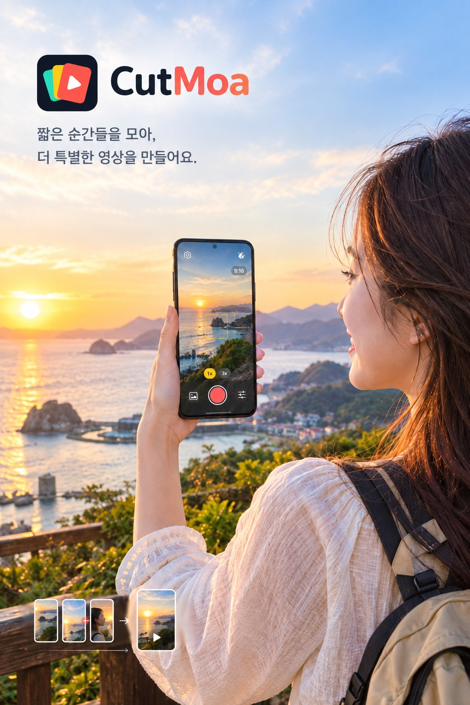
</p>

<p align="center"><sub>홍보용 이미지(ChatGPT 이미지 생성). 화면 속 앱 UI는 연출이며 실제 화면은 아래 <a href="#스크린샷">스크린샷</a> 참고.</sub></p>

## 다운로드

[GitHub Releases](https://github.com/kjt7942/cutmoa/releases/latest)에서 최신 APK(`CutMoa-v*.apk`)를 받아 설치. Android 8.0(API 26) 이상. Play 스토어 밖에서 받은 앱이라 설치할 때 "출처를 알 수 없는 앱" 허용이 필요하고, Play 프로텍트 경고가 뜰 수 있음.

## 목적

카메라 앱을 켜지 않고도, 이 앱 하나로 "여러 개 짧은 클립을 찍고 → 이어 붙이고 → 텍스트/이모지를 원하는 시점·위치에 넣고 → 갤러리에 저장"까지 끝내는 숏폼 제작 도구를 만드는 것이 목표. 편집 프로그램을 따로 켜지 않아도 되는 원스톱 흐름에 집중.

## 최초 기획 스크립트

### 자료조사용 질문

> 안드로이드 환경에서 사용할 숏츠 영상 촬영 앱을 만들어보고 싶어.
> 영상을 찍을때 2초,3초,4초 등 원하는 시간동안 촬영하고 자동으로 촬영을 중단함.
> 이렇게 찍은 짧은 영상을 여러개 선택해서 긴 영상을 만듬.
> 긴 영상에 다양한 자막이나 이모지 등을 추가해서 최종 영상을 결과물로 만듬.
> 이런 앱을 만들기위한 깃허브 프로젝트나 클로드코드용 스킬 등을 추천해줘.

### 클로드 코드에 던진 최초 개발 요청 스크립트

```markdown
# 프로젝트명: 숏츠(Shorts) 구간 촬영 및 편집 앱 (안드로이드)

안녕하세요, 클로드. 나는 안드로이드(Android) 환경에서 동작하는 사용자 정의 숏츠 영상 촬영 및 편집 앱을 개발하려고 해. 네가 나의 수석 아키텍트이자 시니어 안드로이드 개발자가 되어, 단계별로 구체적이고 안정적인 코드를 작성해 주었으면 좋겠어. 먼저 전체적인 앱의 요구사항과 개발 방향을 공유할게.

---

## 1. 앱 핵심 요구사항 (Requirements)
이 앱은 틱톡(TikTok)이나 인스타그램 릴스(Reels)의 핵심 편집 시스템과 유사하며, 크게 3가지 기능으로 구성돼.

1. **타이머 기반 구간 제한 자동 촬영**
   - 사용자가 2초, 3초, 4초 등 원하는 촬영 시간을 설정할 수 있음.
   - 촬영 버튼을 누르면 설정된 시간 동안만 녹화가 진행되고, 시간이 다 되면 자동으로 촬영이 중단되며 비디오 클립 파일(.mp4)로 저장됨.
2. **비디오 클립 멀티 선택 및 병합 (Merge)**
   - 사용자는 방금 촬영했거나 갤러리에 저장된 짧은 비디오 클립들을 여러 개 선택할 수 있음.
   - 선택한 클립들을 순서대로 이어 붙여 하나의 긴 영상(최종 본)으로 병합함.
3. **자막 및 이모지 오버레이 편집**
   - 병합된 영상 위에 사용자가 텍스트 자막이나 이모지(Emoji)를 원하는 위치에 배치하고 크기를 조절할 수 있음.
   - 최종적으로 이 자막과 이모지가 영상에 완전히 합성(렌더링/인코딩)된 완성도 높은 최종 MP4 비디오를 결과물로 출력함.

---

## 2. 추천 기술 스택 및 구현 방식 (Tech Stack)
안정적이고 현대적인 안드로이드 앱 개발을 위해 아래 기술들을 기반으로 코드를 설계해 줘.

- **UI 프레임워크:** Jetpack Compose (모던하고 선언적인 UI 구조 구성)
- **개발 언어:** Kotlin (Coroutines, Flow 활용)
- **카메라 제어:** Google CameraX API (안정적인 비디오 캡처 및 수명 주기 관리)
- **비디오 병합 및 렌더링 (택1 또는 조합 제안 필요):**
  - **방안 A:** Jetpack Media3 Transformer API (구글 공식 모던 미디어 파이프라인)
  - **방안 B:** Mobile-FFmpeg 또는 FFmpeg-Kit 라이브러리 (강력한 비디오 필터 및 concat 기능 제공)
  - *네가 생각하기에 안드로이드 환경에서 자막/이모지 합성 성능과 안정성이 더 뛰어난 방식을 추천해 주고, 그에 맞춰 코드를 작성해 줘.*

---

## 3. 단계별 개발 로드맵 (Roadmap)
우리는 이 프로젝트를 한 번에 다 만들지 않고, 아래 순서대로 단계별(Step-by-step)로 빌드할 거야. 각 단계가 끝날 때마다 작동 가능한 코드가 나와야 해.

- **[1단계] CameraX 기반의 기본 녹화 구현:** 카메라 프리뷰를 띄우고 지정된 경로에 비디오 파일이 정상 저장되는지 확인.
- **[2단계] Coroutine 타이머 연동 자동 중단:** 녹화 시작 시 2~4초 타이머가 작동하고, 시간이 다 되면 `videoCapture.stop()`을 호출하는 로직 완성.
- **[3단계] 미디어 병합 유틸리티 개발:** 여러 개의 MP4 클립 리스트를 받아 하나의 파일로 싱크 오류 없이 인코딩/병합하는 백그라운드 태스크 구현.
- **[4단계] UI 오버레이 및 그래픽 합성:** Compose UI 위에서 자막/이모지 위치를 드래그하고, 최종 영상 프레임 위에 픽셀 단위로 글자와 이미지를 구워 넣는(Render) 엔진 구축.

---

## 4. 앱의 최종 완성도와 안정성을 위한 필수 체크리스트 (Stability & QA)
단순한 토이 프로젝트가 아니라, 실서비스 레벨의 높은 완성도와 안정성을 원해. 코드를 짤 때 아래 예외 상황과 최적화 요소를 반드시 반영해 줘.

- **비디오 사양 통일 (해상도/프레임/코덱):** 여러 클립의 해상도(예: 1080p, 720p)나 프레임 레이트, 가로/세로 비율(Orientation)이 다를 경우 병합 시 깨지거나 멈추는 현상이 발생할 수 있어. 병합 전 사양을 일치시키는 스케일링/트랜스코딩 예외 처리를 포함해 줘.
- **오디오/비디오 싱크(Sync) 유지:** 비디오를 이어 붙일 때 오디오가 밀리거나 뚝뚝 끊기는 현상이 없도록 타임스탬프 정렬 및 오디오 트랙 처리를 신경 써 줘.
- **메모리 관리 및 백그라운드 처리:** 영상 인코딩과 병합은 무거운 작업이야. 메인 스레드가 멈춰서 앱이 죽지 않도록(ANR 방지) 반드시 코루틴 `Dispatchers.IO`나 `WorkManager`를 사용해 백그라운드에서 실행하고, 진행률(Progress %)을 UI에 전달할 수 있게 해줘.
- **카메라 권한 및 상태 관리:** 앱이 백그라운드로 가거나 전화가 오는 등 카메라 수명 주기(Lifecycle)가 바뀔 때 리소스를 안전하게 해제하고 복구하는 로직을 넣어줘.

---

**자, 준비가 되었으면 [1단계: CameraX 기반의 기본 녹화 구조 및 UI 설계]부터 시작하자. 먼저 필요한 의존성(Build.gradle) 설정과 카메라 프리뷰용 Composable 기초 코드를 작성해 줘.**
```

## 구현하려던 주요 기능

- **클립 길이 프리셋 + 커스텀 시간** — 2/3/4초 고정 칩 외에, 사용자가 직접 초를 지정(1~30초)해 최근 2개까지 기억(`DurationPrefs`, SharedPreferences 저장)
- **자동 종료 촬영** — 선택한 시간이 지나면 자동으로 녹화 중지, 진행률 바·카운트다운 표시
- **추적 AF (터치한 사물에 포커스 유지)** — 기본은 연속 자동 포커스. 프리뷰를 탭하면 그 사물을 노란 박스로 표시하며 따라가고, 초점·노출을 계속 그 사물에 맞춤. 다른 곳을 한 번 탭하거나 사물을 놓치면 해제(녹화 중에도 동작)
- **수평·각도 가이드** — 중력 센서로 기울기를 읽어 프리뷰 중앙에 수평선(좌우 기울기)과 위아래 각도 표시를 그림, 맞으면 노란색으로 변함. 폰을 바닥/하늘로 향하면 원형 조준(버블) 가이드로 전환. 녹화 영상에는 찍히지 않음
- **배율 버튼** — 녹화 버튼 위에 삼성 카메라식 둥근 배율 버튼(카메라가 허용하는 최소 배율 + 1/2/3/5/10x 중 범위 안의 값). 녹화 중에도 변경 가능
- **촬영 옵션 (⚙ 버튼)** — 시간 칩의 + 옆 옵션 버튼에서 3×3 격자선 켜기/끄기, 해상도(4K/1080p/720p/480p), FPS(24/30/60) 선택. 기기가 지원하는 값만 표시하고, FPS는 고른 해상도에서 실제로 낼 수 있는 값만 보여줌(예: Galaxy S25 4K는 24/30). 설정은 앱을 다시 켜도 유지(`CaptureSettings`)
- **촬영 중 화면 정리** — 녹화 중에는 "병합하러 가기" 버튼을 숨김
- **촬영본 자동으로 병합 목록에 담기** — 녹화가 저장되면 바로 병합 목록에 추가되고, 촬영 화면 버튼에 "컷 N개 · 병합하러 가기 →"로 표시. 병합 화면에서는 갤러리 클립을 더 고를 수 있고, 각 클립에 "촬영본"/"갤러리" 표시, 제거 전 확인창
- **삭제된 클립 자동 제외** — 목록에 담아둔 클립을 갤러리에서 지우면 병합 화면에 들어올 때와 병합 시작 직전에 목록에서 빼고 안내
- **소리 없는 클립도 병합** — 오디오 트랙이 없는 갤러리 클립은 그 구간을 무음으로 채워 싱크 유지
- **권한 거부 대응** — "다시 묻지 않음"으로 거부된 경우 "설정으로 이동" 버튼 제공
- **여러 클립 이어 찍기 → 한 편으로 병합** — 클립을 여러 번 찍은 뒤 Media3 Transformer로 순서대로 합치기, 프로세스가 죽어도 이어지도록 WorkManager 백그라운드 처리
- **오버레이 편집 (텍스트/이모지)** — 병합된 영상 위에 레이어를 올리고, 레이어를 잡고 끌어 이동·두 손가락으로 크기와 회전(화면 어디서든, 선택된 레이어 대상). 가운데 정렬·90° 단위로 자석처럼 붙고 가이드 선 표시. 크기 슬라이더, 복제, 맨 앞으로, 삭제, 되돌리기/다시 실행
- **보이는 그대로 저장(WYSIWYG)** — 편집 화면과 내보내기가 같은 비트맵 렌더러(`OverlayRenderer`)를 써서 위치·크기·회전·스타일이 그대로 영상에 들어감
- **텍스트 스타일** — 8색, 외곽선/배경 박스/그림자, 여러 줄, 입력하면서 바로 보이는 미리보기. 선택된 텍스트를 한 번 더 탭하면 수정
- **이모지 모음** — 56개 이모지를 하단 시트에서 선택
- **움직임(키프레임) — 켤 때만** — 기본은 고정 위치. "움직임"을 켜면 재생 위치마다 키프레임이 생기고 그 사이를 선형 보간, 마지막 키프레임 이후엔 그 자리에 머묾. ◀ ◆ ▶ 로 키프레임 이동·추가·삭제
- **레이어 타임라인** — 재생선이 가운데 고정, 끌면 영상 탐색·핀치로 확대. 최신 레이어가 맨 위 줄, 선택한 레이어 강조. 탭 선택 / 길게 눌러 끌어 시간 이동 / 넓은 양 끝 손잡이로 길이 조절(재생선에 자석처럼 붙음)
- **편집 보호** — 화면 회전·프로세스 종료 후에도 레이어 유지, 레이어가 있을 때 뒤로 가기를 누르면 확인
- **최종 내보내기 & 저장** — 오버레이까지 합성한 영상을 내보내기 알림과 함께 렌더링하고 MediaStore(갤러리)에 저장
- **결과 화면** — 저장된 최종 영상을 앱 안에서 전체 화면으로 바로 재생(반복 재생 + 재생 컨트롤), 영상 위 버튼으로 공유(`ACTION_SEND`)하거나 처음부터 다시 촬영

## 화면 흐름

`촬영(Record)` → `병합(Merge)` → `오버레이 편집(Overlay)` → `결과(Result)`

- **CameraScreen** — CameraX 기반 구간 녹화(자동 종료), 추적 AF(`SubjectTracker` + `ImageAnalysis`), 수평·각도 가이드(`LevelGuide`), 배율 버튼, 촬영 옵션(격자선·해상도·FPS)
- **MergeScreen** — Media3 Transformer로 클립 병합, `MergeWorker`가 백그라운드에서 처리
- **OverlayEditorScreen** — Media3 ExoPlayer로 병합본 재생/탐색, 캔버스에 레이어를 그리고 직접 만든 제스처 처리(이동·핀치·회전·스냅), `OverlayTimeline`, `OverlayExportWorker`로 내보내기(Media3 `BitmapOverlay`)
- **ResultScreen** — 미디어스토어에 저장된 최종 영상을 `VideoView`로 바로 재생

## 기술 스택

- Kotlin, Jetpack Compose (Material3)
- CameraX 1.4.1 — 영상 촬영, `ImageAnalysis`(추적 AF용 프레임 분석), `ViewPort`(스트림 간 크롭 통일), 해상도·FPS·배율 조회/설정, Camera2 Interop(해상도별 최대 FPS 계산)
- Media3 Transformer/Effect 1.5.0 — 병합(`Presentation`으로 사양 통일, `experimentalSetForceAudioTrack`), 자막·이모지 합성(`BitmapOverlay` + 프레임별 `OverlaySettings`)
- Media3 ExoPlayer 1.5.0 — 편집 화면 병합본 재생(Transformer가 이미 포함하던 라이브러리)
- Android `VideoView` — 결과 화면 재생, 추가 라이브러리 없음
- `android.graphics`(`StaticLayout`, `Canvas`) — 자막·이모지 비트맵 렌더링(`OverlayRenderer`), 편집 화면과 내보내기가 같은 비트맵 사용
- Compose `Canvas` + `awaitEachGesture` — 레이어 그리기, 이동·핀치·회전·스냅 제스처 직접 구현
- Material Icons Extended — 편집 도구 아이콘(되돌리기, 복제, 맨 앞 등)
- Navigation Compose — 화면 전환
- WorkManager — 프로세스 종료에도 살아남는 백그라운드 병합/내보내기
- Accompanist Permissions — 런타임 권한 처리
- Android SensorManager(중력 센서) — 수평·각도 가이드, 추가 라이브러리 없음
- JUnit 4 — 추적 로직·좌표 변환·오버레이 키프레임/기하 계산 JVM 유닛 테스트(17개)
- 배포 — `apksigner`로 서명 확인, GitHub CLI(`gh release create`)로 GitHub Releases 업로드

## 요구 사항

- minSdk 26, targetSdk/compileSdk 35
- JDK 17

## 빌드

```bash
./gradlew assembleDebug        # 디버그 APK 빌드
./gradlew installDebug         # 연결된 기기에 설치
./gradlew testDebugUnitTest    # 유닛 테스트
./gradlew assembleRelease      # 서명된 릴리즈 APK (local.properties에 서명 정보 필요)
./gradlew bundleRelease        # Play 스토어 업로드용 AAB
```

릴리즈 서명 정보는 git에 올리지 않는 `local.properties`에 둔다. 없으면 릴리즈 빌드는 서명 없이 나온다.

```properties
RELEASE_STORE_FILE=D:/keys/cutmoa-release.jks
RELEASE_STORE_PASSWORD=...
RELEASE_KEY_ALIAS=cutmoa
RELEASE_KEY_PASSWORD=...
```

## 개발 기록

파일 수정 시각과 git 커밋 시각을 근거로 시간 순 정리.

### 2026-09-04 — 최초 구현

1. **19:27 ~ 19:38 — 프로젝트 골격 구성**
   `settings.gradle.kts`, 루트/앱 `build.gradle.kts`, `gradle.properties`, `proguard-rules.pro` 작성. 리소스(`strings.xml`, `colors.xml`, `themes.xml`, 런처 아이콘) 추가.
2. **19:31 ~ 19:38 — 유틸리티 및 병합 기반 작업**
   `ExportNotifications`(내보내기 알림), `MergeWorker`(백그라운드 병합), `MediaStoreExport`(미디어스토어 저장), `ResultScreen`, `AppNavHost`, `MainActivity` 작성.
3. **20:54 — Gradle 래퍼 정리 및 `VideoMerger` 작성**
   Media3 Transformer 기반 영상 병합 로직 구현.
4. **22:25 ~ 22:26 — 오버레이 모델/직렬화/내보내기**
   `OverlayModels`(텍스트·스티커 데이터 모델), `OverlaySerialization`, `OverlayExporter`, `OverlayExportWorker` 작성.
5. **23:26 ~ 23:55 — 카메라 설정 및 프레임 유틸**
   `DurationPrefs`(촬영 길이 설정), `VideoFrameUtil`(썸네일 추출), `MergeScreen`(병합 화면 UI) 작성.
6. **00:24 ~ 01:06 — 오버레이 편집 UI 및 카메라 캡처 완성**
   `OverlayEditorScreen`(드래그·스케일 편집), `OverlayTimeline`(타임라인 UI), `VideoCaptureManager`(CameraX 녹화), `AndroidManifest.xml`, `CameraScreen` 작성 — 촬영→병합→오버레이→결과 전체 흐름 완성.
7. **01:52 — Git 저장소 초기화 및 GitHub 푸시**
   `.gitignore` 추가, 전체 소스 최초 커밋, GitHub(`kjt7942/short-video-app`) public 저장소 생성 후 푸시.
8. **01:53 — README 작성**
   프로젝트 개요, 화면 흐름, 기술 스택 문서화 후 커밋/푸시.
9. **02:02 ~ 02:34 — README 개발일지 정리**
   개발 기록, 목적·주요 기능, 저장소 링크, 최초 기획 스크립트 원문, 스크린샷, 트러블슈팅, 향후 계획을 차례로 추가하고 개발일지 템플릿 순서로 재정렬.

### 2026-09-14 21:36 — 터치 포커스 추가 (`04bf867`)

- `VideoCaptureManager`가 `bindToLifecycle`이 돌려주는 `Camera`를 버리고 있어 `cameraControl` 접근 불가 → 필드로 보관하고 `focusAt(MeteringPoint)` 추가(`FocusMeteringAction`).
- `CameraScreen`의 `PreviewView`에 터치 리스너를 달아 `meteringPointFactory`로 화면 좌표를 센서 좌표로 변환 후 포커스 요청.
- 자동 포커스는 CameraX가 `VideoCapture` 바인딩 시 기본으로 연속 비디오 AF를 쓰므로 별도 코드 불필요.

### 2026-09-14 21:36 ~ 22:49 — 수평·각도 가이드 추가 (`c519f49`)

> 이 섹션부터 "삼성 기본 카메라 스타일로 UI 다듬기"까지 세 작업은 기기 확인을 마친 뒤 한 커밋으로 묶어 올림.

- 삼성 기본 카메라의 수평 가이드를 참고해 `LevelGuide.kt` 작성. 라이브러리 없이 `SensorManager`(`TYPE_GRAVITY`, 없으면 가속도계 + 로우패스 필터)만 사용.
- 좌우 기울기(roll) = `atan2(gx, gy)`, 위아래 각도(pitch) = `asin(-gz / |g|)`. 앱이 세로 고정이라 기기 좌표계를 그대로 화면 좌표로 쓸 수 있음.
- 가로로 들고 찍는 경우도 있어 가장 가까운 90° 기준으로 수평 판정. pitch가 ±70°를 넘으면 roll이 의미 없어지므로 위에서 내려다보는 촬영용 버블 가이드로 전환.
- 센서 값을 Compose `Canvas`의 draw 단계에서만 읽어, 초당 수십 번 값이 바뀌어도 리컴포지션 없이 다시 그리기만 발생.

### 2026-09-14 21:36 ~ 22:49 — 추적 AF(트래킹 포커스) 추가 (`c519f49`)

- 요청: "터치한 사물을 계속해서 포커스를 유지하도록 하고싶어. 포커스 유지하는 동안 해당 사물을 추적하면서 표시하고, 해제하려면 다른곳에 한번 터치하면 해제되는 식으로" (기본 카메라 앱의 추적 AF).
- 추적 엔진 선택: ML Kit 객체 감지(눈에 띄는 사물만 감지, APK 증가) vs 직접 구현한 템플릿 매칭(아무 사물이나 가능, 빠른 움직임·크기 변화에 약함) 중 **템플릿 매칭** 선택 — 의존성 없이 벽 무늬·물체 일부 등 어떤 영역이든 잡을 수 있어서.
- `SubjectTracker.kt` — 320px 폭으로 줄인 흑백(Y) 프레임에서 32×32 패치를 직전 위치 ±16px 범위에서 찾음. 노출 변화에 버티도록 평균을 뺀 SAD로 비교하고, 매칭이 좋을 때만 템플릿을 10%씩 갱신. 8프레임 연속 못 찾으면 해제. JVM 유닛 테스트(`SubjectTrackerTest`)로 이동 추적·해제 동작 검증.
- `VideoCaptureManager` — Preview + VideoCapture에 640×480 `ImageAnalysis` 스트림을 추가(미지원 기기는 기존 1회 터치 포커스로 폴백). 세 스트림을 9:16 `ViewPort`로 묶어 같은 화각을 보게 하고, 화면 좌표 ↔ 분석 버퍼 좌표는 회전값·크롭 영역으로 직접 변환(`BufferMapping`).
- 초점 유지 방식: 탭 시 `FocusMeteringAction`(`disableAutoCancel`)으로 그 지점에 AF·AE를 트리거하고 고정. 추적 중에는 박스가 화면 폭의 8% 이상 움직였고 직전 요청 후 0.7초가 지났을 때만 새 위치로 다시 트리거. 해제 시 `cancelFocusAndMetering()`으로 연속 AF 복귀. (처음엔 Camera2 Interop으로 AF 영역만 갱신하는 방식이었으나 실제로 초점이 안 옮겨져 교체 — 트러블슈팅 참고)
- 추적은 분석 스레드, UI·카메라 제어는 메인 스레드. 시작/해제마다 세대(generation) 번호를 올려, 해제 직후 도착한 이전 프레임 결과가 박스를 다시 띄우지 않게 처리.

### 2026-09-14 21:36 ~ 22:49 — 삼성 기본 카메라 스타일로 UI 다듬기 + 추적 박스·초점 버그 수정 (`c519f49`)

- 요청: 삼성 기본 카메라 실행 화면 캡처 3장과 함께 "이거랑 비슷하게 구현해줘".
- 수평 가이드를 캡처 비율대로 재구성: 원형 링 + 링을 가로지르는 수평선(실제 수평을 따라 기울어짐) + 양 끝 고정 눈금 + 링 안의 위아래 각도 사다리와 초록색 각도 표시. 밝은 배경에서도 보이도록 옅은 그림자 테두리 추가.
- 추적 박스를 얇은 외곽선 + 굵은 둥근 모서리 브래킷 형태로 변경.
- adb로 앱 실행 → 화면 탭(`input tap`) → `screencap`으로 캡처하며 박스 위치를 직접 검증, 아래 두 버그를 발견해 수정([트러블슈팅](#트러블슈팅--배운-점) 참고).

### 2026-09-14 23:00 — 앱 이름 변경: ShortsApp → 컷모아(CutMoa) (`e7e831a`)

- 이름 후보(컷모아 / 숏컷캠 / 컷컷 / 이어캠 / 스냅컷 / 3초컷) 중 "짧은 컷을 모아 한 편으로"라는 앱 흐름이 그대로 드러나는 **컷모아** 선택. "쇼츠(Shorts)"는 유튜브 상표라 스토어 등록을 고려해 이름에서 제외.
- 패키지 `com.kjt.shortsapp` → `com.kjt.cutmoa`, 테마 `Theme.CutMoa`, 저장 폴더 `Movies/CutMoa`, 파일명 접두어 `CUTMOA_`로 일괄 변경.
- 저장소도 새 이름으로 이전: 전체 커밋 이력을 [`cutmoa`](https://github.com/kjt7942/cutmoa)로 옮긴 뒤(기존 master가 새 저장소에 포함된 것을 `git merge-base --is-ancestor`로 확인), 기존 `short-video-app` 저장소는 삭제.

### 2026-09-15 00:38 — 앱 아이콘 제작 (`1f88c0a`)

- 방향 3가지(A. 모이는 컷 / B. 뷰파인더 속 컷 / C. 잘린 필름) 중 이름 뜻이 바로 보이는 **A안** 선택. 색은 앱 안에서 이미 쓰는 녹화 버튼 코랄 레드·추적 박스 노랑·어두운 배경에서 가져옴.
- ChatGPT 이미지 생성에 사용한 프롬프트:

```
안드로이드 앱 아이콘을 만들어줘. 앱 이름은 "컷모아(CutMoa)"이고, 짧은 영상 컷을 여러 개 찍어서 하나의 숏폼 영상으로 모아주는 카메라·편집 앱이야.

[콘셉트]
- 둥근 모서리 직사각형 카드 3장(짧은 영상 클립을 의미)이 살짝 부채꼴로 겹쳐지면서 가운데로 모이는 모습
- 맨 앞 카드 중앙에 둥근 재생(▶) 삼각형
- "여러 컷이 하나로 모인다"는 느낌이 한눈에 들어오게

[스타일]
- 플랫하고 굵은 기하학적 벡터 스타일, 모던하고 깔끔하게
- 은은한 그림자 정도만 허용, 사실적인 질감·3D·과한 그라데이션은 금지
- 48px 크기로 줄여도 형태가 알아볼 수 있을 만큼 단순하게

[색상]
- 배경: 짙은 차콜 네이비 (#16181D), 화면 전체를 꽉 채우는 단색
- 카드: 뒤에서부터 민트(#7DE3C3) → 노랑(#FFC928) → 코랄 레드(#FF5A4E)
- 재생 버튼: 흰색

[규칙]
- 1024x1024 정사각형 PNG
- 글자·로고타입·숫자 절대 넣지 말 것
- 아이콘 자체에 둥근 모서리나 원형 테두리를 넣지 말 것 (안드로이드가 알아서 마스크를 씌움)
- 핵심 그림은 가운데 60% 영역 안에만 배치하고 바깥은 배경만 둘 것
```

- 생성된 이미지는 디자인은 좋았지만 3개 시안이 한 장에 합쳐져 있고, 배경에 압축 얼룩·번짐이 있으며 투명 레이어가 없어서 그대로 쓰기 어려웠음. 형태가 단순한 플랫 도형이라 **이미지를 잘라 쓰는 대신 벡터(VectorDrawable)로 다시 그림** — 모든 해상도에서 선명하고, 배경색과 전경을 분리한 adaptive icon으로 바로 적용 가능.
- 카드 3장(28×34, 모서리 5)을 -27° / -12° / 15°로 회전해 부채꼴 배치, 앞 카드가 뒤 카드에 드리우는 반투명 그림자, 둥근 모서리 재생 삼각형(stroke round join). 전체를 adaptive icon 안전 영역(지름 66dp) 안에 배치.
- 같은 좌표로 SVG를 만들어 헤드리스 Edge로 PNG 렌더링, 108dp 레이어와 원형 마스크 적용 모습을 확인하며 조정(`docs/icon/icon_preview.png`).

### 2026-09-15 23:46 — 결과 화면에서 완성 영상 바로 재생 (`47d77c2`)

- 요청: "동영상 병합하고 나서 완성된 동영상을 재생해볼수있으면 좋겠어. 매번 갤러리에 가서 재생하는게 불편해."
- 기존 결과 화면은 저장된 `content://` URI 문자열만 보여줘서, 결과를 보려면 갤러리 앱으로 이동해야 했음.
- URI 텍스트 자리를 영상 플레이어로 교체. 새 의존성(ExoPlayer) 없이 안드로이드 기본 `VideoView` + `MediaController`를 Compose `AndroidView`로 감쌈. 화면에 들어오면 자동 재생·반복, 탭하면 재생/일시정지·탐색 컨트롤 표시, 화면을 벗어나면 `stopPlayback()`으로 해제.
- `:app:compileDebugKotlin` 빌드 통과 후 Galaxy S25에 설치해 재생 확인 — 이때 문구·버튼이 시스템 바에 가려지는 문제를 발견해 다음 작업으로 이어짐.

### 2026-09-16 00:04 ~ 00:12 — 결과 화면을 전체 화면 재생으로 변경 (`6c22e74`)

- Galaxy S25(Android 16)에 설치해 보니 상단 문구가 상태바에, 하단 버튼이 내비게이션 바에 가려짐. 요청: "상단 텍스트, 하단 버튼이 제대로 표시되지않고 가려짐. 그냥 영상을 풀화면으로 재생해볼수있게 해도 좋을거같은데! 버튼이 필요하다면 영상 위에 표시해도 되고."
- 원인: 앱이 `enableEdgeToEdge()`로 시스템 바 뒤까지 그리는데, 다른 화면은 `Scaffold`/`statusBarsPadding`으로 여백을 잡는 반면 결과 화면만 인셋 처리가 없었음.
- 검은 배경에 영상을 화면 전체로 깔고, 문구와 "새로 촬영하기" 버튼은 상태바 아래 상단에 반투명 알약 모양으로 띄움. 하단은 `MediaController` 재생 바가 뜨는 자리라 비워 둠.
- 검은 배경에서 상태바 아이콘이 안 보이는 문제는 촬영 화면에 이미 있던 "시스템 바 아이콘 흰색 + 스크림 제거" 코드를 `util/SystemBars.kt`의 `LightSystemBarIcons()`로 옮겨 두 화면이 같이 쓰도록 함.
- `adb exec-out screencap`으로 기기 화면을 캡처해 가며 확인: 상태바·재생 컨트롤·버튼 모두 가려지지 않음.

### 2026-09-16 00:21 — 편집 화면에서 병합본 재생 (`ee8758f`)

- 요청: "편집 화면에서도 병합본 재생되게 해줘"
- 기존 편집 화면은 `MediaMetadataRetriever`로 재생 위치의 정지 프레임(가장 가까운 키프레임)만 디코딩해 보여줬음.
- 미리보기를 Media3 ExoPlayer로 교체(`media3-transformer`가 이미 끌어오던 라이브러리라 APK 증가 없음). "텍스트 추가" 옆 ▶/⏸ 버튼으로 재생하면 매 프레임 플레이어 위치가 재생선(`playheadMs`)이 되어 타임라인과 오버레이 위치·크기가 영상을 따라감. 멈춘 상태에선 타임라인을 끌면 그 시점으로 정확히 탐색.
- `SurfaceView`가 아닌 `TextureView`에 출력 — 뷰 계층 안에서 그려져서 캔버스 확대/이동(`graphicsLayer`)이 영상에도 같이 적용됨.
- 재생 중 오버레이를 끌면 자동 일시정지(키프레임이 재생선 위치에 찍히므로), 앱이 백그라운드로 가면 일시정지. 쓰지 않게 된 `VideoFrameUtil.frameAt(path, timeMs)` 삭제.
- 빌드·설치까지 확인. 기기에서 재생 동작 확인은 아직.

### 2026-09-16 00:37 ~ 00:54 — 촬영 옵션(격자선·해상도·FPS), 배율 버튼, 녹화 중 버튼 숨김 (`4824198`)

- 요청: "영상 촬영할때 옵션을 추가해보자. 우선 3*3 격자 켜고 끌수있게 + 버튼 옆에 옵션버튼 추가하고, 옵션버튼 눌르면 격자선 켬/끔 설정할 수 있게 하자. 동영상 촬영할때 스마트폰에서 지원하는 배율, 해상도, FPS 선택기능도 추가하자." / 작업 중 추가 요청: "영상 촬영중에는 병합하러가기버튼 안보이게 하자."
- **옵션 다이얼로그** — 시간 칩 + 옆 ⚙ 버튼. 격자선 스위치, 해상도 칩(`Recorder.getVideoCapabilities().getSupportedQualities()`), FPS 칩(`CameraInfo.supportedFrameRateRanges`). 설정은 `CaptureSettings`(SharedPreferences)에 저장. 해상도/FPS를 바꾸면 카메라 use case를 다시 바인딩하도록 `VideoCaptureManager`를 `rebind()` 구조로 정리(Preview도 매니저가 생성).
- **배율** — `zoomState`의 최소~최대 배율(S25: 0.6~10x) 안에서 버튼 제공, `setZoomRatio`. 다시 바인딩해도 고른 배율 유지.
- **FPS 후보 정리** — S25는 `[26, 26]`, `[27, 27]`, `[53, 53]` 같은 애매한 고정 범위도 알려줘서 24/30/60/120만 남김. 그리고 센서 전체 목록은 해상도별이 아니라서, 고른 해상도의 최소 프레임 간격(`SCALER_STREAM_CONFIGURATION_MAP.getOutputMinFrameDuration`, Camera2 Interop)으로 최대 FPS를 계산해 거름.
- **실기기 검증** — adb로 설정 파일을 바꿔 앱을 재시작하고, 녹화 버튼 탭 → 저장된 mp4를 `ffprobe`로 해상도·실제 프레임 수를 재고, `dumpsys media.camera`로 카메라에 실제로 걸린 스트림/AE FPS 범위를 확인하는 식으로 조합별 테스트. 결과는 아래 트러블슈팅 참고.
- 녹화 중에는 "병합하러 가기" 버튼을 숨김(진행 바와 같은 `isRecording` 분기).

### 2026-09-16 17:04 — 권한 거부 막힘 해결, 공유 버튼, 클립 추가 선택 시 기존 선택 유지 (`91cc844`)

- 권한을 "다시 묻지 않음"으로 거부하면 앱이 요청을 계속 반복하면서 멈춘 것처럼 보였음 → 첫 요청 이후에는 자동으로 다시 묻지 않고 "설정으로 이동" 버튼 표시.
- 병합 화면에서 클립 선택기를 다시 열면 기존 선택이 지워졌음 → 기존 목록 뒤에 이어 붙이도록 변경.
- 결과 화면에 공유 버튼(`Intent.ACTION_SEND`) 추가.
- 프로젝트 첫 lint 실행에서 에러 77개가 나왔는데, 모두 이미 의도하고 쓰던 실험적 API에 `@OptIn`/`@SuppressLint`가 빠진 것이었음(동작 버그 아님). `app/lint.xml`과 어노테이션으로 정리 → lint 에러 0.

### 2026-09-16 19:16 ~ 20:15 — 촬영한 컷이 병합 목록에 자동으로 담기게, 백그라운드 작업 추적 방식 수정 (`e76ac90`)

- 기존에는 촬영 후 병합 화면에서 방금 찍은 클립을 갤러리에서 다시 골라야 했음.
- **컷 목록을 상위(`AppNavHost`)로 올림** — 촬영 화면과 병합 화면이 같은 목록(`QueuedClip`)을 공유. 녹화가 끝나면(`VideoRecordEvent.Finalize`) 저장된 URI를 목록에 추가하고, 같은 URI는 중복 추가하지 않음(`LazyColumn` 키 중복으로 크래시 나는 것 방지). `rememberSaveable` + 문자열 `listSaver`로 화면 회전·프로세스 종료 후에도 유지. "새로 촬영하기"를 누르면 목록 초기화.
- 촬영 화면 버튼에 컷 개수 표시, 병합 목록에 촬영본/갤러리 구분 표시, 클립 제거 전 확인창(`AlertDialog`) 추가.
- **병합·내보내기 작업을 이름으로 추적** — 기존에는 `remember`에 저장한 작업 id로 추적해서, 화면을 회전하면 id가 사라져 실행 중인 작업을 놓쳤고 시작 버튼이 다시 나타나 같은 작업을 겹쳐 실행할 수 있었음. `enqueueUniqueWork`(고정 이름, `ExistingWorkPolicy.KEEP`)로 실행하고 `getWorkInfosForUniqueWorkFlow`로 추적하도록 변경.
- **작업 추적 방식을 바꾸면서 생긴 버그 수정** — 이름으로 조회하면 이미 끝난 이전 작업(SUCCEEDED) 기록도 같이 나와서, 병합 화면에 다시 들어오면 곧바로 **이전 병합 영상으로 편집 화면으로 넘어가 버렸음**(내보내기 화면도 같은 구조). 결과를 받아 다음 화면으로 넘어갈 때 `workManager.pruneWork()`로 끝난 작업 기록을 지우도록 수정.
- `assembleDebug` + 유닛 테스트 통과 후 Galaxy S25(SM-S931N)에서 adb로 전체 흐름 테스트:
  - 3초 컷 3개 촬영 → 버튼에 "컷 3개 · 병합하러 가기 →" 표시, 병합 화면에 촬영본 3개가 순서대로 담김
  - 병합(`MergeWorker` SUCCESS) → 병합 파일 9.13초(3초×3), 영상+오디오 트랙 모두 있음(`ffprobe`로 확인)
  - 최종 영상 만들기(`OverlayExportWorker` SUCCESS) → `Movies/CutMoa/CUTMOA_FINAL_*.mp4`로 갤러리 저장, 9.13초
  - "새로 촬영하기" → 병합 화면으로 가면 목록이 비어 있고 이전 결과로 넘어가지 않음
- 테스트 중 확인한 것: 처음 병합 화면에 들어갔을 때 **이전 빌드로 19:39에 병합한 5초짜리 영상으로 편집 화면이 바로 열림**. 수정 전 빌드가 남긴 SUCCEEDED 기록 때문이었고, 그때 `pruneWork()`가 실행돼 기록이 지워진 뒤로는 재현되지 않음. 업데이트 직후 한 번만 생기는 현상.

### 2026-09-16 20:18 ~ 20:26 — 남은 한계 정리 + 실기기 전체 흐름 재검증 (`e76ac90`)

> 바로 위 작업과 함께 20:29에 한 커밋으로 올림.

- 요청: "그냥 완벽하다고 얘기할수있게 제대로 완성시켜"
- **소리 없는 클립 병합** — `Composition.Builder.experimentalSetForceAudioTrack(true)`(media3 1.5.0에서의 이름, 이후 버전의 `setForceAudioTrack`)로 오디오 없는 클립 구간을 무음으로 채움.
- **갤러리에서 삭제된 클립** — 병합 화면 진입 시와 병합 시작 직전에 `ContentResolver.openFileDescriptor`로 열리는지 확인해 안 열리는 클립은 목록에서 빼고 토스트로 안내(하나만 없어도 병합 전체가 실패하던 문제).
- **"새로 촬영하기" 시 끝난 작업 기록 정리** — 이전 병합 실패 메시지가 새 촬영의 병합 화면에 남지 않도록 `pruneWork()`.
- **실기기(Galaxy S25) 검증** — 전부 adb로 조작하고 `ffprobe`/`ffmpeg`로 결과 파일 확인:
  - 컷 3개 촬영 → 홈으로 나간 뒤 `am kill`로 프로세스 종료 → 최근 앱에서 복귀 시 "컷 3개" 그대로 복원
  - 담아둔 컷 1개를 MediaStore에서 삭제 → 병합 화면에서 자동으로 빠지고 2개만 남음
  - 소리 없는 테스트 영상(ffmpeg `testsrc`, 오디오 없음)을 갤러리에서 추가해 가운데 배치 → 병합 성공, 오디오 9.11초/영상 9.04초로 길이 일치, 가운데 구간 오디오 -91dB(무음), 해당 구간 프레임이 테스트 영상으로 나옴
  - 노란 자막 "CutMoa TEST" + 🔥 이모지(0~2초) 추가 → 내보내기 성공, 1초 프레임에는 자막·이모지가 있고 4.5초 프레임에는 없음
  - 타임라인은 스크롤로 9초 끝까지 확인 가능
  - "새로 촬영하기" → 병합 화면 목록 비어 있고 이전 결과로 넘어가지 않음
  - 편집 화면 ▶ 재생 → 1.5초 사이 재생선이 약 1.4초 → 3.4초로 이동
- 화면 방향은 세로 고정(`screenOrientation="portrait"`)이라 회전 시나리오는 해당 없음.

### 2026-09-16 20:34 ~ 20:40 — 릴리즈 서명 설정 (`764446c`)

- 요청: "니가 키스토어 만들고 설정까지 해줘"
- JDK 17의 `keytool`로 키스토어 생성(RSA 2048, 유효기간 10000일, 별칭 `cutmoa`). 저장소 밖(`D:\keys\`)에 두고, 비밀번호는 무작위 24자로 만들어 git에서 제외된 `local.properties`에만 저장.
- `app/build.gradle.kts`가 `local.properties`에서 서명 정보를 읽어 `release` 빌드에 적용. 서명 정보가 없는 환경(다른 PC, CI)에서도 빌드가 깨지지 않도록 값이 있을 때만 서명 설정을 만듦.
- 처음에 `java.util.Properties()`를 `android { }` 근처에서 그대로 쓰니 `Unresolved reference: util` — Gradle Kotlin DSL에서 `java`가 Java 플러그인 확장으로 해석됨. 파일 맨 위에 `import java.util.Properties`로 해결.
- `assembleRelease` 후 `apksigner verify --print-certs`로 `CN=kjt7942, O=CutMoa, C=KR` 서명 확인. 기존 debug 앱은 서명이 달라 덮어쓰기가 안 되므로 삭제 후 release APK 설치.

### 2026-09-16 20:47 ~ 20:55 — 촬영 화면 위·아래에 흰 띠가 생기던 문제 수정 (`5a5865c`)

- 요청: "영상 촬영화면 풀로 나왔었는데, 왜 위,아래에 흰색배경 보여?"
- 원인: `LightSystemBarIcons()`가 화면에 들어올 때 이전 시스템 바 설정을 저장했다가, 화면이 사라질 때(`onDispose`) 되돌리는 구조였음. 그런데 화면 전환 애니메이션 중에는 **들어오는 화면이 먼저 설정을 적용하고, 나가는 화면이 나중에 dispose**됨. 결과 화면 → "새로 촬영하기"로 돌아오면 결과 화면의 "복구"가 촬영 화면 설정을 덮어써서 상태바·내비게이션 바에 흰 스크림 + 검은 아이콘이 생김.
- 수정: 저장/복구를 없애고 `SystemBarsFor(darkContent)`로 **화면마다 자기 모양을 선언**. 적용 시점은 해당 내비게이션 목적지의 `ON_RESUME`(전환이 끝나고 실제로 보이는 화면만 resume됨)이라 순서 경쟁이 생기지 않음. 촬영·결과 화면은 `darkContent = true`, 병합·편집 화면은 `false`.
- 실기기 확인: 앱 시작 → 촬영(풀화면) → 병합(흰 배경·검은 아이콘) → 편집 → 결과(풀화면) → 새로 촬영하기(풀화면 유지), 병합 화면에서 뒤로 가기(풀화면 유지).

### 2026-09-16 20:56 ~ 21:34 — 자막·이모지 편집 전면 재개발 (`bc7803f`, 실기기 확인 `2c391c2`)

- 요청: "텍스트,이모지 추가부분은 레이어표시도 잘 안되고, 조절도 어렵다. 이부분 심도있게 다시 개발해봐. 나 외출하고 올테니까 알아서 고민해서 잘 만들어놔." / "에뮬레이터 없으면 설치해서 테스트해도 돼."
- **기존 코드 분석 — "조절이 어렵다"의 원인은 조작감보다 더 깊었음**
  1. *미리보기와 결과물이 달랐음* — 위치를 검은 여백까지 포함한 박스 기준으로 저장, 편집 화면은 글자 왼쪽 위 모서리·결과물은 가운데를 기준점으로 사용, 글자 크기는 화면 sp와 고정 px로 약 2배 차이, 반투명 배경은 편집 화면에만 있음.
  2. *조작* — 먼저 탭해서 선택해야 끌 수 있고, 크기 조절은 작은 글자 위에 두 손가락을 정확히 올려야 함. 20dp짜리 수정·삭제 버튼이 글자를 가리고, 영상 확대 제스처와도 충돌.
  3. *의도치 않은 움직임* — 다른 시점에서 옮기면 키프레임이 자동으로 생겨 레이어가 혼자 움직임.
  4. *레이어 표시* — 재생 위치가 구간 밖이면 화면에서 사라지는데, 타임라인에 어떤 레이어가 선택됐는지 표시가 없음. 바를 끌면 타임라인 스크롤과 충돌, 길이 조절 손잡이는 14dp.
- **설계**
  - `OverlayRenderer` — 텍스트/이모지를 `StaticLayout`으로 비트맵에 그림(1080px 폭 기준 크기). 편집 화면은 이 비트맵을 캔버스에 그리고, 내보내기는 같은 비트맵을 Media3 `BitmapOverlay`로 넘김 → 보이는 그대로 저장. 외곽선·배경 박스·그림자 스타일도 여기서 처리.
  - `OverlayGeometry` — 영상 영역 계산(fit), 레이어 화면 배치, 회전을 반영한 터치 판정, 가운데·90° 스냅. 순수 계산이라 JVM 유닛 테스트로 검증.
  - 캔버스 제스처를 한 곳에서 직접 처리 — 손가락이 닿은 가장 위 레이어를 즉시 선택하고 끌어 이동, 두 손가락은 화면 어디서든 선택된 레이어의 크기·회전. 스냅은 "원래 제스처 값"을 따로 추적해 한 번 붙으면 빠져나오지 못하는 문제를 피함. 한 제스처 = 되돌리기 한 단계.
  - 모델 — `Keyframe`에 회전 추가, `OverlayItem`에 스타일·`animated` 추가. 움직임을 끈 레이어는 포즈 하나만 가짐.
  - 타임라인 — 재생선 가운데 고정·끌어서 탐색, 길게 눌러 시간 이동, 22dp 손잡이, 선택 강조, 키프레임 표시.
  - 편집 화면을 어두운 테마로(영상 편집기 관례, 촬영·결과 화면과 통일).
- **테스트 준비** — 폰이 없어서 기존 AVD(`ShortsEmulator`, Android 15)를 창 없이 실행. ffmpeg로 **격자 무늬 테스트 영상**(가운데 빨간 십자, 108×192 격자)을 만들어 위치를 눈금으로 잴 수 있게 함. adb `uiautomator dump`로 화면 요소를 글자로 찾아 누르는 셸 함수를 만들어 "촬영 화면 → 병합 → 편집" 이동을 자동화. adb `input`은 한 손가락만 되므로, 에뮬레이터 터치 장치(`/dev/input/event2`)에 `sendevent`로 멀티터치 이벤트를 직접 보내 두 손가락 회전·확대를 재현.
- **에뮬레이터 검증 결과**
  - 편집 화면 ↔ 저장된 영상 비교(격자 기준 비율): 텍스트 가운데 x 0.25/0.247, y 0.18/0.18, 폭 45.8%/45% · 이모지 가운데 0.506/0.50, 0.61/0.61, 폭 29%/28.6%.
  - 두 손가락으로 45° 회전 + 1.5배 → 결과 영상에서도 같은 방향·크기(Media3 회전은 반시계 방향이라 부호를 뒤집음).
  - 움직임: 0.2초 가운데 → 1.05초 중간 → 2.5초 이동한 자리에 머묾.
  - 길게 눌러 시간 이동(0.1초 → 1.1초), 끝 손잡이로 길이 조절 시 재생선에 붙음, 결과 화면에서 뒤로 오면 레이어 유지, 뒤로 가기 확인창.
  - 유닛 테스트 12개 추가(총 17개), `assembleRelease`·lint 오류 0.
- **테스트하면서 찾아 고친 것**
  - 눈금자의 초 표시가 화면 오른쪽 끝을 넘으면 `drawText`에 음수 폭이 들어가 **앱이 종료됨** → 글자를 먼저 측정한 뒤 그림.
  - 레이어를 선택하면 도구 패널이 커지면서 미리보기가 줄어 영상이 손가락 아래에서 움직임 → 패널 높이 고정.
  - 선택된 바 위를 끌어 탐색하려다 레이어 시간이 옮겨짐 → 일반 끌기는 항상 탐색, 시간 이동은 길게 눌러 끌기로.
  - 영상 길이 띠와 긴 레이어 바가 화면 폭에서 잘림(`width()`가 부모 폭으로 제한됨) → `wrapContentWidth(unbounded = true)`.
  - 움직임을 켤 때 시작·끝 키프레임을 같이 만들었더니, 중간에서 옮기면 끝에서 제자리로 돌아감 → 현재 위치에 키프레임 하나만 만들고 마지막 이후엔 머물게(`animated` 플래그).
  - 편집 중 뒤로 가기 한 번에 모든 레이어가 확인 없이 사라짐 → 확인창.
- 알려진 점: 에뮬레이터에서는 편집 화면에 처음 들어왔을 때 멈춘 영상이 검게 보이고 타임라인을 한 번 끌면 나타남(디코더 로그 `fetchGraphicBlock failed`). 같은 `TextureView` 방식을 쓰던 이전 버전이 실제 폰에선 바로 보였기 때문에 에뮬레이터 문제로 판단. → 22:52 Galaxy S25에 release 빌드 설치 후 확인: 첫 진입부터 영상이 바로 보임(에뮬레이터 한정 현상).

### 2026-09-16 23:00 — 첫 릴리스 v1.0 (GitHub Releases, `258ad77`)

- 요청: "apk파일 배포는 어떻게 할 수 있어?" → "GitHub Releases에 올려줘"
- 배포 방법 비교: 파일 직접 전달 / GitHub Releases / Firebase App Distribution / Google Play(AAB, 등록비·비공개 테스트 필요). 공개 저장소라 링크만으로 받을 수 있고 포트폴리오 링크로도 쓰기 좋은 GitHub Releases를 선택.
- 이전 빌드 결과를 지우고 release APK를 새로 빌드, `apksigner verify`로 서명(`CN=kjt7942, O=CutMoa, C=KR`), `aapt2 dump badging`으로 패키지·버전(versionCode 1 / versionName 1.0) 확인 후 `gh release create`로 업로드. 릴리스 노트에 SHA-256 기재.
- 다음 버전부터는 `versionCode`를 올리고 같은 키스토어로 서명해야 기존 설치본 위에 업데이트됨.
- 친구 배포용 안내: 바로 다운로드 링크(`releases/download/v1.0/CutMoa-v1.0.apk`)를 보내고, 카톡 인앱 브라우저에서 안 받아지면 외부 브라우저로 열기 → "출처를 알 수 없는 앱" 허용 → Play 프로텍트 경고는 "무시하고 설치". 안드로이드 8.0 이상만 가능, 아이폰 불가.

### 2026-09-16 23:22 — 홍보 이미지 추가

- ChatGPT 이미지 생성으로 만든 홍보 이미지(1024×1536, 앱 아이콘 + "짧은 순간들을 모아, 더 특별한 영상을 만들어요." 문구, 촬영 → 컷 모으기 흐름 연출)를 `docs/promo/cutmoa_promo.jpg`로 저장(PNG 2.2MB → JPG 약 290KB)하고 README 상단에 배치.
- 이미지 속 휴대폰 화면은 생성된 연출이라 실제 앱 UI와 다름 — README에 그 점을 적고 실제 화면은 스크린샷 섹션으로 연결.

## 스크린샷

| 촬영 | 클립 병합 | 자막·이모지 오버레이 (09-16 재개발 전) | 결과 (전체 화면 재생) |
|---|---|---|---|
|  |  |  | 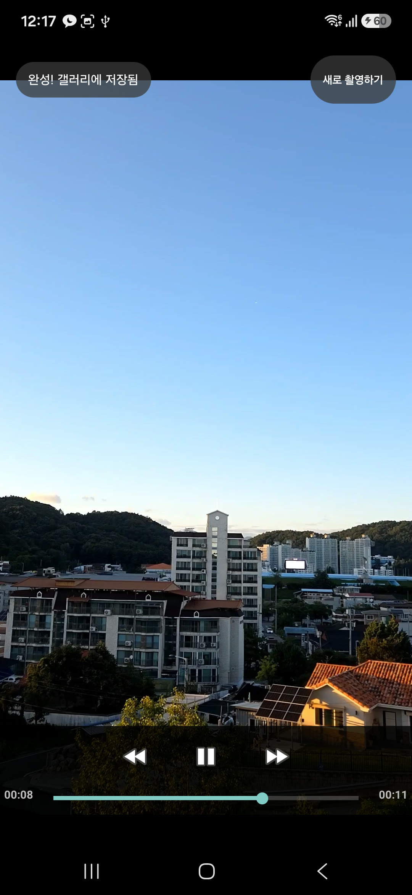 |

### 촬영 옵션 (2026-09-16 추가)

| 격자선 + 배율 버튼 + 옵션(⚙) 버튼 | 촬영 옵션 다이얼로그 |
|---|---|
| 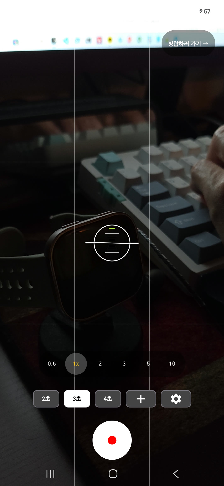 | 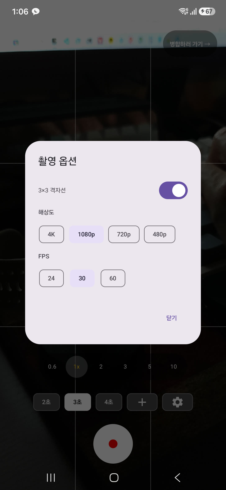 |

### 컷 자동 담기 (2026-09-16 추가)

| 촬영 화면 — 찍은 컷 개수 표시 | 병합 화면 — 촬영본이 자동으로 담김 |
|---|---|
| 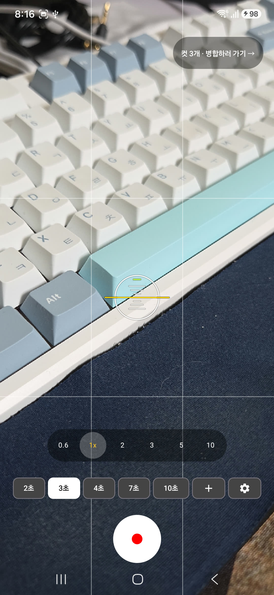 | 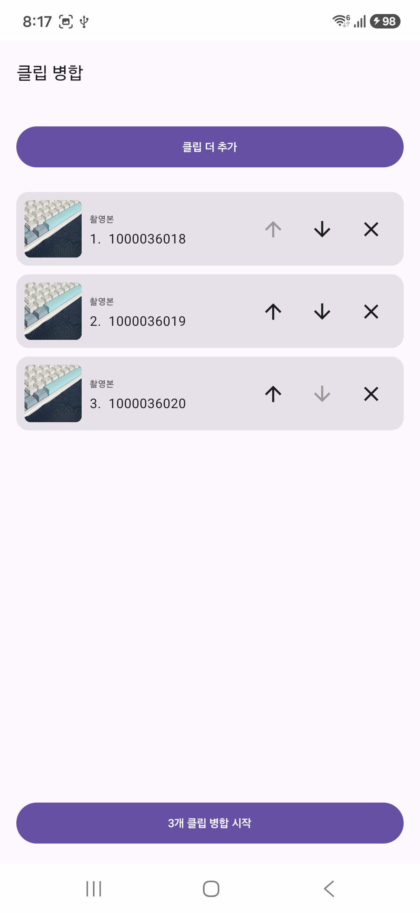 |

### 자막·이모지 편집 (2026-09-16 재개발, 에뮬레이터)

| 레이어 선택 — 회전·확대된 이모지, 도구 패널 | 텍스트 수정 — 스타일·색·실시간 미리보기 | 이모지 모음 |
|---|---|---|
| 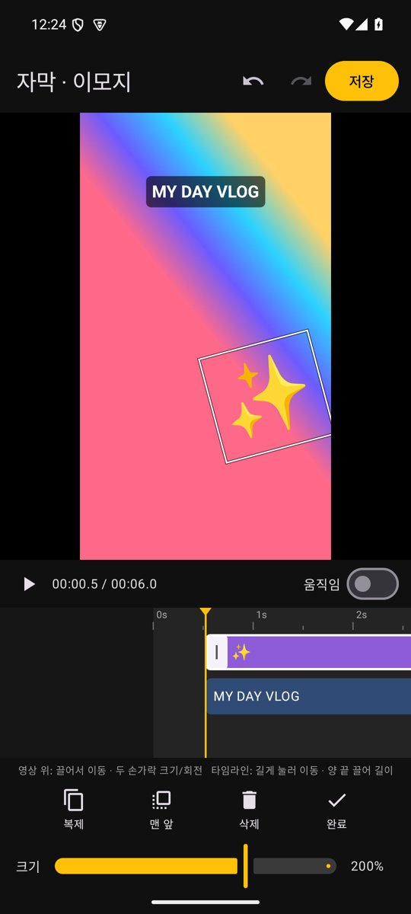 | 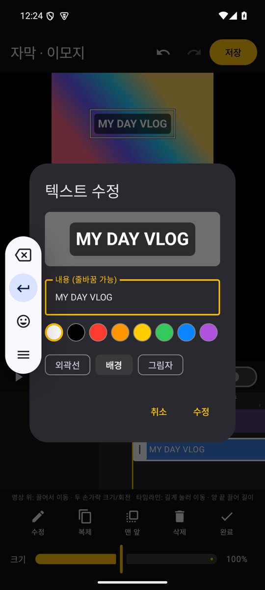 | 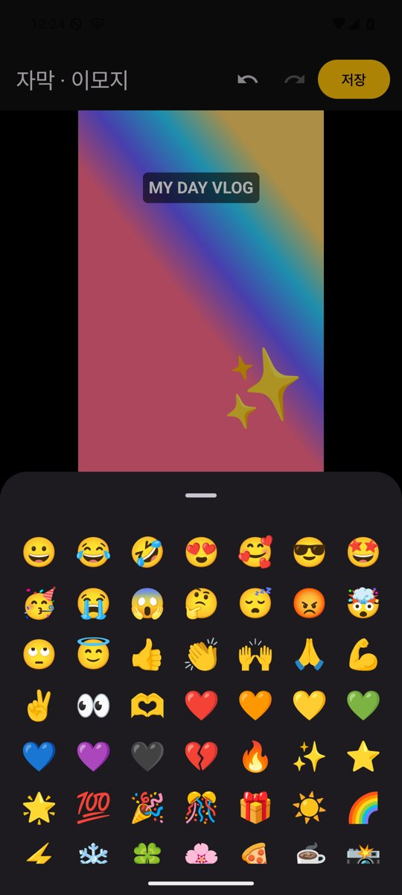 |

| 편집 화면(왼쪽) vs 저장된 영상(오른쪽) — 격자 테스트 영상 | 움직임 결과 — 0.2초 / 1.05초 / 2.5초 프레임 |
|---|---|
| 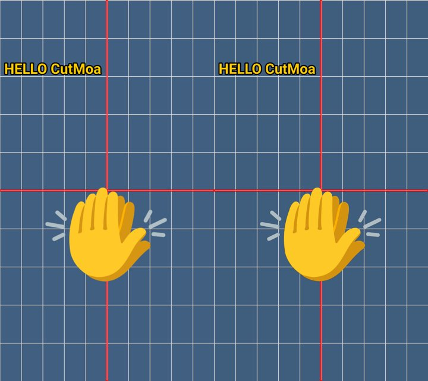 | 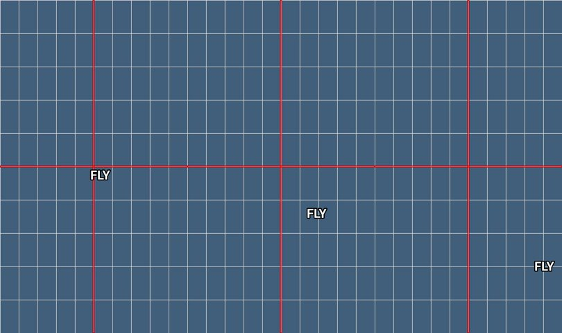 |

| 실기기(Galaxy S25) — 재개발한 편집 화면 첫 진입 |
|---|
| 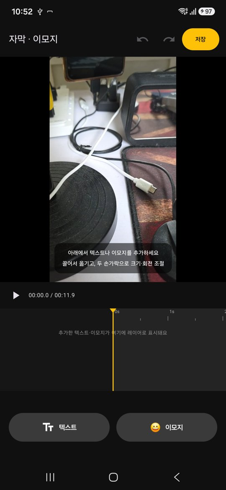 |

### 앱 아이콘

| ChatGPT 컨셉 이미지 | 벡터로 다시 그린 최종 아이콘 (왼쪽: 108dp 레이어와 안전 영역, 오른쪽: 원형 마스크 적용) |
|---|---|
| 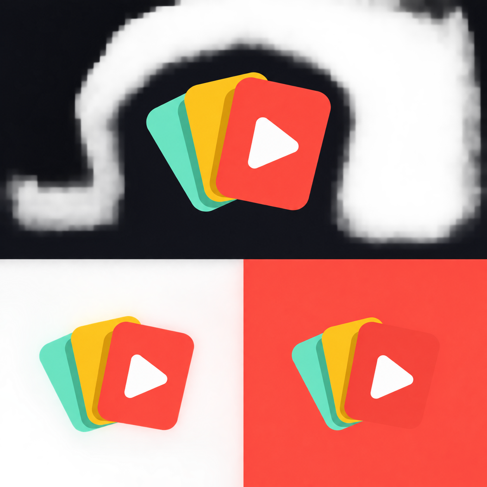 |  |

## 트러블슈팅 · 배운 점

코드에 남긴 근거(주석)를 기준으로 실제 부딪힌 문제와 해결 방식 정리.

- **클립마다 해상도/프레임레이트가 다르면 병합이 깨짐** — 세로 1080p 클립과 가로 720p 클립을 그냥 이어 붙이면 재생이 멈추거나 깨질 수 있어서, `VideoMerger`가 모든 클립을 병합 전에 동일한 `Presentation`(해상도 + fit 모드)으로 강제 통과시키도록 처리(`VideoMerger.kt:28`).
- **Media3 Transformer는 진행률 콜백을 안 줌** — push 방식 콜백이 없고 polling으로만 진행 상태를 얻을 수 있어서, `VideoMerger`에서 주기적으로 상태를 poll해 진행률(%)을 계산(`VideoMerger.kt:93`).
- **WorkManager `Data`는 플랫 값만 전달 가능** — 오버레이 리스트는 아이템마다 키프레임 개수가 다른 가변 구조라 WorkManager로 직접 넘길 수 없음. 별도 직렬화 라이브러리를 추가하는 대신 플랫폼 내장 `org.json`으로 JSON 문자열 하나로 말아서 `OverlayExportWorker`에 전달(`OverlaySerialization.kt:9`).
- **오버레이 좌표계와 Media3 좌표계가 서로 다름** — 에디터는 화면 기준 fractional 좌상단(0~1, y-down) 좌표를 쓰는데 Media3 오버레이 프레임은 NDC(-1~1, 중심 원점, y-up)라서 그대로 넘기면 텍스트/이모지가 위아래로 뒤집힘. 내보내기 시점에 Y축을 반전해서 변환(`OverlayExporter.kt:124`).
- **카메라 풀스크린 프리뷰인데 내비게이션 바 뒤에 어두운 스크림이 깔림** — 3버튼 내비게이션 모드에서 시스템이 가독성을 위해 자동으로 scrim을 그려서 카메라 화면이 하단만 어둡게 보임. `isNavigationBarContrastEnforced = false` + 라이트 아이콘 강제로 해제(지금은 `SystemBars.kt:40`의 `SystemBarsFor`).
- **미리보기와 결과물을 따로 그리면 절대 안 맞음** — 편집 화면은 Compose `Text`(sp, 왼쪽 위 기준), 내보내기는 Media3 `TextOverlay`(px, 가운데 기준)라 위치·크기·배경이 제각각이었음. 좌표계를 "영상 폭 대비 비율 + 가운데 기준"으로 통일하고, 두 쪽이 **같은 비트맵**을 쓰게 해 해결(`OverlayRenderer`). Media3 오버레이는 비트맵을 출력 프레임 픽셀 크기 그대로 그리므로, 가장 크게 커지는 키프레임 배율로 한 번 렌더링하고 프레임마다 `setScale`로 줄여 확대해도 흐려지지 않게 함.
- **작은 대상에 제스처를 요구하면 조작이 어려움** — 두 손가락을 작은 글자 위에 올리게 하지 말고, 한 손가락으로 잡아 선택·이동하고 두 손가락은 화면 어디서든 선택된 레이어에 적용. 스냅은 원래 제스처 값을 따로 들고 있어야 붙었다 떨어지는 게 자연스러움.
- **같은 끌기를 두 가지 뜻으로 쓰지 않기** — 타임라인에서 "끌기 = 탐색"과 "끌기 = 레이어 이동"이 겹치면 탐색하다 레이어를 망가뜨림. 끌기는 항상 탐색, 이동은 길게 누른 뒤로 분리.
- **Compose `width()`는 부모 폭을 넘지 못함** — 화면보다 긴 타임라인 요소는 `wrapContentWidth(unbounded = true)`를 먼저 걸어야 함.
- **에뮬레이터에서 두 손가락 테스트하기** — `adb shell input`은 한 손가락뿐. `adb root` 후 `getevent -lp`로 멀티터치 장치를 찾고 `sendevent`로 `ABS_MT_SLOT`/`TRACKING_ID`/`POSITION_X·Y`/`PRESSURE`를 보내면 핀치·회전을 재현할 수 있음(`BTN_TOUCH`만으로는 반응 없음).
- **촬영 진행 바가 1초 단위로 뚝뚝 끊김** — 초 단위 카운터로 진행률을 올리면 바가 계단식으로 점프. 50ms마다 실제 경과 시간(wall clock)으로 진행률을 계산해 부드럽게 채우고, 같은 루프가 시간이 다 되면 자동 종료까지 담당(`CameraScreen.kt:179`).
- **추적 박스가 찌그러지고 엉뚱한 곳에 그려짐 (1) 스트림마다 화각이 다름** — 4:3 분석 프레임과 프리뷰가 각자 다른 영역을 잘라 써서 좌표가 맞지 않았음. `ViewPort`(9:16, 녹화 영상 비율)로 모든 스트림의 크롭을 통일(`VideoCaptureManager.kt:188`).
- **(2) CameraX `ImageProxyTransformFactory` 행렬이 축이 뒤바뀐 채 나옴** — 로그로 행렬을 찍어보니 640×480(회전 90°, 크롭 y 60~420) 버퍼를 360×640짜리처럼 매핑하고 있었고, 정사각형 박스가 1:3으로 늘어난 원인과 수치가 정확히 일치. 회전값·크롭 영역으로 직접 변환하는 `BufferMapping`으로 교체하고, 기기에서 찍은 실제 값으로 유닛 테스트 작성(`VideoCaptureManager.kt:496`, `BufferMappingTest`).
- **어두운 화면에서 추적 박스가 혼자 떠돌아다님** — 렌즈가 가려진 상태처럼 무늬가 없으면 모든 후보 위치의 점수가 비슷하고, 센서 노이즈 때문에 매 프레임 "조금 더 나은" 위치가 생겨 박스가 랜덤하게 이동. 현재 위치보다 20% 이상 좋은 매칭일 때만 이동하도록 변경, 노이즈 프레임 테스트로 재현·검증(`SubjectTracker.kt:6`의 `MOVE_RATIO`, `SubjectTrackerTest.staysPutOnDarkNoisyScene`).
- **추적 AF에서 터치한 사물로 초점이 안 옮겨짐** — 초점이 흔들리지 않게 하려고 연속 AF 모드는 그대로 두고 Camera2 Interop으로 `CONTROL_AF_REGIONS`만 바꿨는데, 연속 AF는 장면 변화가 없으면 다시 스캔하지 않아서 영역을 바꿔도 렌즈가 움직이지 않았음. `FocusMeteringAction`으로 명시적으로 AF를 트리거하는 방식으로 교체하고, 결과(`isFocusSuccessful`)를 로그로 남겨 검증.
- **추적 중 초점이 계속 취소됨** — 박스가 움직일 때마다 0.1초 간격으로 새 초점 요청을 보내니 이전 스캔이 끝나기 전에 취소(`superseded`)되는 게 로그에 찍힘. 이동 거리 조건에 최소 0.7초 간격을 추가해 스캔이 끝날 시간을 확보.
- **결과 화면 버튼 배경이 위쪽 절반만 사라짐** — 알약 배경을 반투명 검정(`alpha 0.4`)으로 했더니, 버튼이 영상 위쪽 검은 여백(레터박스)과 영상에 걸쳐 있어서 여백 쪽 절반은 검정 위 검정이라 안 보였음. 기기 캡처로 발견하고, 어느 배경 위에서도 보이도록 반투명 회색으로 변경(`ResultScreen.kt`의 `PILL_COLOR`).
- **1080p로 설정했는데 실제로는 720p로 녹화되고 있었음** — 촬영 옵션을 검증하다 발견. 저장된 클립을 `ffprobe`로 재보니 1080p·4K를 골라도 720×1280. `dumpsys media.camera`에는 1440×1080 스트림 하나 + 추적 AF용 640×480 스트림만 떠 있었음: 프리뷰 + 녹화 + 분석 3개를 동시에 못 여는 조합이라 CameraX가 프리뷰와 녹화를 한 스트림으로 공유(stream sharing)시키고, `QualitySelector`에 폴백을 허용해 둔 탓에 에러 없이 조용히 HD로 내려감(로그: `Using supported quality of HD for surface size 720x1280`). 추적 AF를 붙인 09-14 이후 계속 그랬던 것. 고른 해상도를 폴백 없이 먼저 시도하고, 안 되면 분석 스트림(추적 AF)을 빼고, 그래도 안 될 때만 낮은 화질로 폴백하도록 바인딩 순서를 바꿈 → 1080p는 추적 AF를 유지한 채 1080×1920, 4K는 추적 AF 없이 2160×3840(`VideoCaptureManager.kt`의 `Attempt` 목록).
- **60fps를 골라도 30fps로 녹화됨** — 바인딩은 성공하는데 `VideoCapture` 로그의 `StreamSpec`이 `expectedFrameRateRange=[0, 0]`(미지정)이고 클립도 30fps. 카메라 특성 덤프의 최소 프레임 간격을 계산해 보니 1080p·720p 스트림은 60fps까지 되지만 **추적 AF용 640×480 분석 스트림이 30fps 한계**라, 같이 묶이면 CameraX가 목표 FPS를 조용히 버림. FPS를 직접 고르면 분석 스트림 없이 바인딩 → 1080p/60이 실제 59.98fps로 저장. 같은 덤프에서 **4K 스트림은 최대 30fps**라 4K/60은 원래 불가능 → FPS 칩을 해상도별 최대 FPS로 거르게 함.
- **손떨림 보정이 켜져 있으면 4K/24도 무시됨** — 보정을 켠 채 테스트하니 1080p/60은 적용됐지만 4K/24는 다시 `[0, 0]` → 30fps. 조합마다 결과가 달라 믿을 수 없어서, FPS를 직접 고르면 프리뷰·영상 보정을 끄도록 함(24/60fps 촬영은 보정 없음).
- **알려진 한계 — 촬영 옵션** — FPS를 30이 아닌 값으로 고르거나 4K를 고르면 추적 AF가 꺼지고 탭은 일회성 초점으로 동작. FPS 30은 기존처럼 카메라에 맡겨서 어두운 곳에선 30 미만으로 떨어질 수 있음. 60fps로 찍은 클립도 병합 결과는 1080×1920으로 맞춰짐(4K 클립도 병합하면 1080p).
- **알려진 한계 — 추적 AF** — 초점 재트리거 조건이 "화면상 이동 거리"라서, 사물이 화면 위치는 그대로인 채 앞뒤로만 움직이면 초점을 다시 잡지 않음(`VideoCaptureManager.kt:402`). 템플릿 매칭 특성상 빠른 움직임·크기 변화·가려짐에 약하고, 놓침 판정 임계값(`lostScore`)은 실기기에서 조정이 필요한 값(`SubjectTracker.kt:22`).
- **`remember`에 저장한 작업 id는 화면 회전에 사라짐** — WorkManager 작업은 화면과 상관없이 계속 도는데, 그 작업의 id를 Compose `remember`에만 들고 있으면 회전하는 순간 id를 잃어 진행률도 결과도 못 받음. 고정 이름으로 작업을 등록(`enqueueUniqueWork`)하면 언제 다시 들어와도 같은 이름으로 찾을 수 있음(`MergeWorker.UNIQUE_WORK_NAME`).
- **이름으로 조회하면 끝난 작업 기록도 나옴** — WorkManager는 끝난 작업 기록을 한동안 보관해서, 고정 이름으로 조회하면 지난번 SUCCEEDED 기록이 나오고 "완료되면 다음 화면으로" 로직이 화면에 들어오자마자 다시 실행됨. 결과를 받은 직후 `pruneWork()`로 기록을 지워 해결.
- **dispose 시점에 "원래대로 복구"하는 전역 설정은 화면 전환과 경쟁함** — Compose Navigation은 전환 중 두 화면이 동시에 떠 있고, 나가는 화면의 `onDispose`가 들어오는 화면의 effect보다 늦게 실행됨. 창(window) 같은 전역 상태는 저장/복구 대신 각 화면이 resume될 때 자기 상태를 다시 적용하는 쪽이 안전함(`SystemBars.kt`).
- **media3 API 이름은 버전마다 다름** — 코드 주석에 적어둔 `EditedMediaItemSequence.Builder().setForceAudioTrack()`는 1.5.0에 없었음. 설치된 jar를 열어 실제 메서드를 찾아보니 `Composition.Builder.experimentalSetForceAudioTrack`. 문서보다 쓰고 있는 버전의 jar를 먼저 확인하는 게 빠름.
- **알려진 한계 — 수평 가이드** — 센서 구독이 촬영 화면이 떠 있는 동안 유지돼, 앱이 백그라운드로 가도 계속 동작(`LevelGuide.kt:66`).

## 향후 계획

- **자막·이모지 편집 실기기 조작감 확인** — 에뮬레이터로 검증한 제스처(두 손가락 회전·확대, 길게 눌러 이동)를 실제 손가락으로 확인
- **텍스트 스타일 추가** — 글꼴 선택, 커스텀 색상(HSV 피커), 등장/퇴장 효과(페이드)
- **테마 아이콘(Android 13+) 대응** — 단색 `monochrome` 레이어 추가
- **자막 편집 추가 기능** — 레이어 잠금·숨기기, 편집 화면에서 여러 레이어 동시 선택, 편집 내용을 앱 종료 뒤에도 남기는 임시 저장(지금은 편집 화면을 나가면 사라짐)
- **추적 AF 고도화** — 크기 변화·빠른 움직임 대응(피라미드 탐색, 스케일 추정), 앞뒤로만 움직이는 사물을 위한 주기적 재초점, 필요 시 ML Kit 객체 감지와 병행
- **포커스 UX 보강** — 길게 눌러 AF/AE 고정(lock), 노출 밝기 슬라이더
- **가이드 옵션** — 수평 가이드 켜기/끄기 토글(촬영 옵션 다이얼로그에 추가), 수평이 맞았을 때 짧은 진동, 백그라운드 전환 시 센서 해제(`LifecycleResumeEffect`)
- **고FPS·4K에서도 추적 AF** — 60fps를 낼 수 있는 크기의 분석 스트림을 찾아 쓰거나, 녹화 프레임을 공유하는 방식으로 60fps/4K에서도 추적 AF 유지. 두 손가락 핀치 줌도 추가 가능
- **배경음악(BGM) 삽입** — 병합 영상에 오디오 트랙 추가/믹싱 기능
- **필터/보정** — 밝기·채도 등 기본 영상 필터, Media3 Effect로 확장
- **오버레이 템플릿 저장/재사용** — 자주 쓰는 자막·이모지 배치를 템플릿으로 저장했다가 다음 영상에 재사용
- **자동 테스트 확대** — 지금은 JVM 유닛 테스트 17개(`SubjectTrackerTest`, `BufferMappingTest`, `OverlayLogicTest`). 기기가 필요한 병합(`VideoMerger`)·렌더링(`OverlayRenderer`)·내보내기는 이번에 adb로 손으로 검증한 것을 계측 테스트(androidTest)로 옮기기
- **배포** — 릴리즈 서명·GitHub Releases v1.0 완료. 다음은 버전 올릴 때 `versionCode` 자동 증가, Play Console 등록(AAB, 스토어 스크린샷·설명, 개인정보처리방침)
